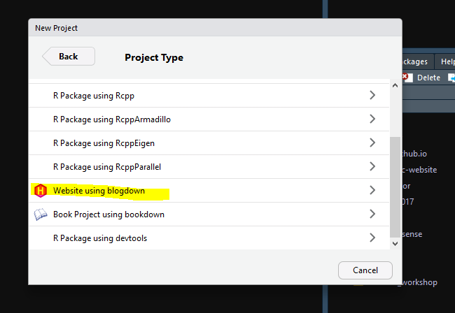
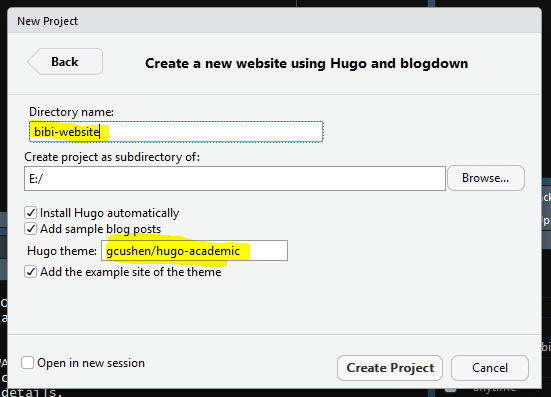
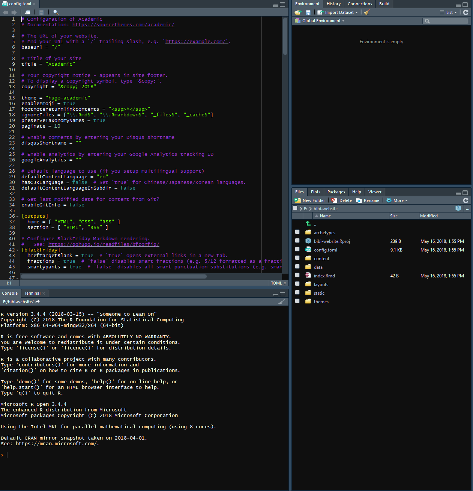
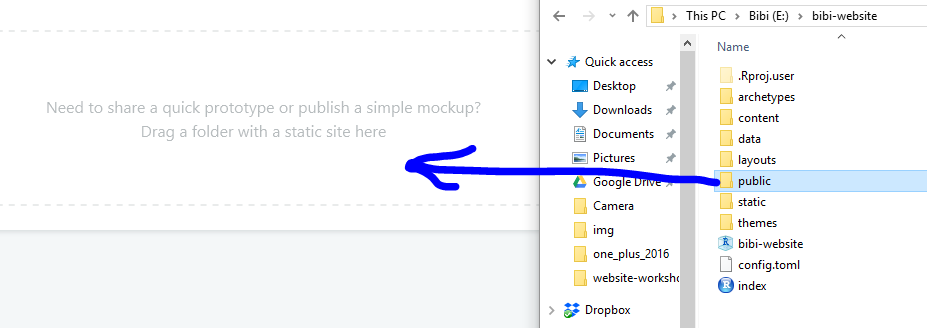
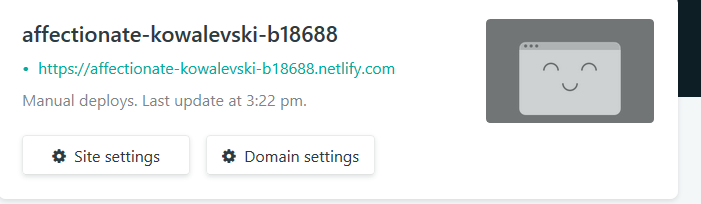
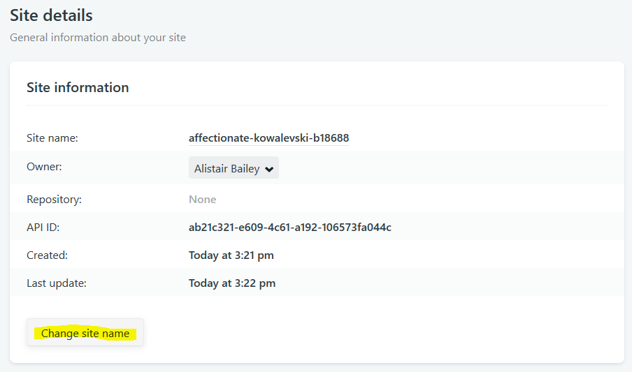

# Creating and deploying an initial website

## Creating a website in R

We're going to create a website for Bibi the Cat aka The Tiny Tiger.

Here she is:

(ref:bibi-cat) Bibi the Cat

```{r bibi-cat, fig.cap='(ref:bibi-cat)', out.width = '50%', echo=FALSE}

```

Go to `File > New Project > New directory` and then scroll down and choose 
**Website using blogdown**.

```{r choose-blogdown, out.width = '120%',echo=FALSE}

```

This will then take you to the another screen where you can choose the directory
for the website and we choose the theme.

Given Bibi's interests in [rheology](https://www.drgoulu.com/wp-content/uploads/2017/09/Rheology-of-cats.pdf) we'll be using the hugo-academic theme,
this is selected by entering `gchusen/hugo-academic` in the box as shown in 
Figure \@ref(fig:choose-theme)

(ref:choose-theme) Create a new directory with a suitable name with no spaces and
choose a theme, here we're using `gchusen/hugo-academic`.

```{r choose-theme, fig.cap='(ref:choose-theme)',out.width = '120%', echo=FALSE}

```

Then `Create Project` and it should download the necessary files, change the 
working directory to the one created and you should see something like this:

```{r rstudio-web, fig.cap='(ref:rstudio-web)', out.width = '120%', echo=FALSE}

```

There are a bunch of folders and files, and the script editor pane is open 
with the `confog.toml` file open for editing.

As example files are provided we can build a website immediately using:

```{r serve-site, eval=FALSE}
blogdown::serve_site()
```

And we should see the example site open in the `Viewer` pane.

## Deployment

The simplest way to delpoy our website is to use [netlify](https://www.netlify.com/).

Create and account or connect via another account such as [GitHub](https://github.com/)
and then from the `Sites` tab that should appear if you click on your name,
drag and drop the public folder from the directory into the box like so:

```{r netlify-drag, out.width = '120%',echo=FALSE}

```

Assuming that goes ok, you'll then see a randomly generated name for your new site.
Click on `Site settings` to change the name to whatever you wish.

```{r netlify-name,out.width = '120%', echo=FALSE}

```

You should see the option to change the name like so. Click and follow the 
instructions.

```{r netlify-change-name,out.width = '120%', echo=FALSE}

```

Click on your name to get back to `Sites` and then click on the name of your
website to view it.

Congratulations, you've created and deployed a website.

Next, we'll go back into R to learn how to change the content.
