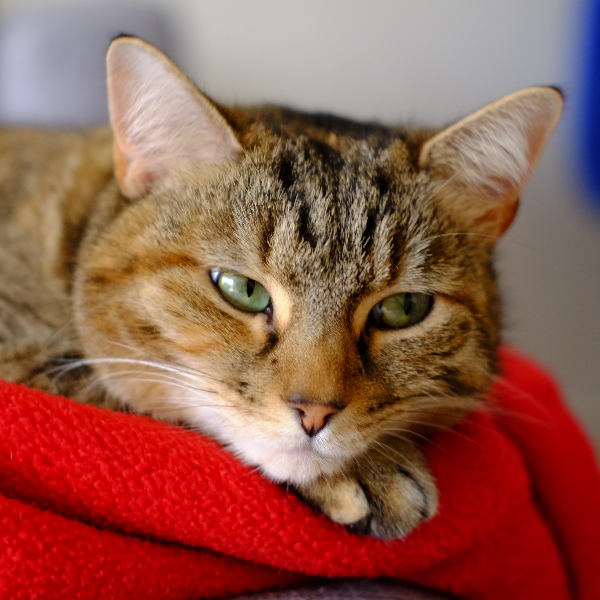

# Creating and deploying an initial website

We're going to create a website for Bibi the Cat aka The Tiny Tiger.

Here she is:

(ref:bibi-cat) Bibi the Cat

```{r bibi-cat, fig.cap='(ref:bibi-cat)', fig.width = 4, echo=FALSE}

```

Go to File > New Project and when the pop-up appears choose a new directory
and then scroll down and choose **Website using blogdown**.

```{r choose-blogdown, echo=FALSE}

```

This will then take you to the another screen where you can choose the directory
for the website and we choose the theme.

Given Bibi's interests in [rheology](https://www.drgoulu.com/wp-content/uploads/2017/09/Rheology-of-cats.pdf) we'll be using the hugo-academic theme,
this is selected by entering `gchusen/hugo-academic` in the box as shown in 
Figure \@ref(fig:choose-theme)

(ref:choose-theme) Create a new directory with a suitable name with no spaces and
choose a theme, here we're using `gchusen/hugo-academic`.

```{r choose-theme, fig.cap='(ref:choose-theme)', echo=FALSE}

```