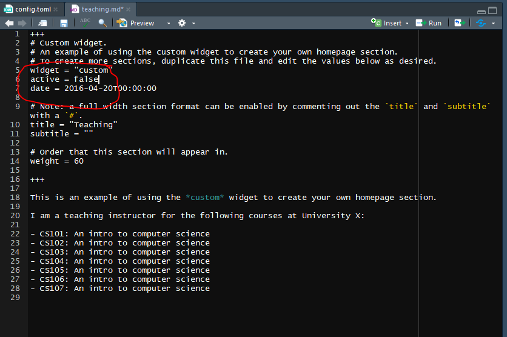
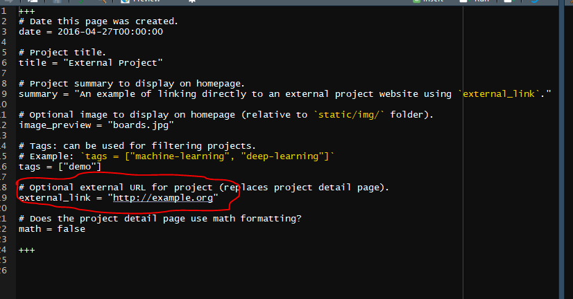
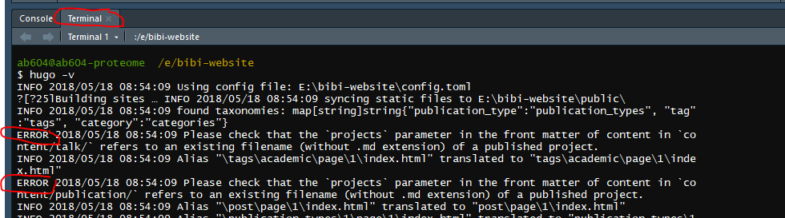
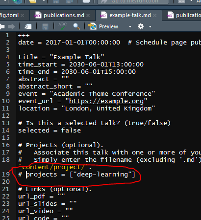

# Adding content to the site

## The file structure in R

The folder containing the published website as we saw in the last 
chapter is the `public` folder. 

The `config.toml` file is where we set the global configurations for the site.

For detail see the TOML syntax [blogdown chapter](https://bookdown.org/yihui/blogdown/configuration.html), 
but most of what we're going to change is quite straightoforward, see 
[Configuration][Configuration]

The `content` folder contains subdirectories containing the files that we create
or edit for the sections on the website e.g. publications or project pages.

Images and other files we might want (such a CV) go in the `static` folder and 
sub-folders respectively. These will then be copied to the `public` folder when 
we build the site.

We don't need to touch the other folders for the purposes of this tutorial,
but as before the [blogdown book](https://bookdown.org/yihui/blogdown) has all the details.


## Configuration

Here we'll configure the `config.toml` file.

1. First we'll change the title:

```{r title}
# Title of your site
title = "Professor Bibi Cat"
```

2. Then we change the details:

```{r details}
  # Your details.
  name = "Bibi the Cat"
  role = "Professor of Chaos Theory and Practice"
  
  # Organizations/Affiliations.
  #   Separate multiple entries with a comma, using the form: 
  # `[ {name="Org1", url=""}, {name="Org2", url=""} ]`.
  organizations = [ { name = "Feline University", url = "" } ]
```

3. Next we change the avatar picture by copying an image to `static/img` and
either calling it `potrait.jpg` or changing the name in the `config.toml` file.
We'll also change the other details, deleting anything we don't want:

```{r avatar}
  gravatar = false  # Get your avatar from Gravatar.com? (true/false)
  avatar = "portrait.jpg"  # Specify an avatar image (in `static/img/` folder) 
                           # or delete value to disable avatar.
  email = "bibi@example.org"
  address = "Red Fleecy Blanket, Southampton"
  office_hours = "Whenever I'm hungry"
  phone = ""
  skype = ""
  telegram = ""
```


4. Then we'll change the social media icons to include ORCID, this uses the  `ai` icon pack, rather than the `fa` icon pack:

```{r networking-icons, eval=FALSE}
[[params.social]]
    icon = "orcid"
    icon_pack = "ai"
    link = "https://orcid.org/0000-000X-XXXX-XXXX"

  [[params.social]]
    icon = "twitter"
    icon_pack = "fa"
    link = "//twitter.com/bibi-the-cat"
```

5. We can add, move or remove links that appear on the homepage of the website.
Bibi is too busy sleeping to write blog posts or do any teaching, but she
would like to promote her CV which we'll add to the `static/files` folder:

```{r edit-links}
[[menu.main]]
  name = "Home"
  url = "#about"
  weight = 1

[[menu.main]]
  name = "Publications"
  url = "#publications"
  weight = 2

[[menu.main]]
  name = "CV"
  url = "/files/cv.pdf"
  weight = 3

[[menu.main]]
  name = "Projects"
  url = "#projects"
  weight = 4


[[menu.main]]
  name = "Contact"
  url = "#contact"
  weight = 6
```

Explore to find out what else you can change, such as the publication format.

## Choosing sections and editing the biography

In the `content/home` folder are a series of files which configure the
sections widgets.

To turn a section off, open the relevant file and change `active = true` to
`active = false`.

For example, Bibi is far too busy sleeping to do any teaching, so we'll turn
of the teaching widget by opening `teaching.md` and changing the `active` status.

```{r turn-off-widget,out.width = '120%', echo=FALSE, eval=TRUE}

```

Let's do this for `hero`, `publications_selected`, `posts`,`talks` and 
`teaching`.

And now look at the updated site. `hero` controlled the top banner, and
`publications` is where the link on our menu bar links to.

## Editing section content 

The template files in `content/home` are written in markdown, lightweight 
markup 
language, where for example `#` indicates Heading 1 and `##` Heading 2.
See the [markdown cheatsheet](https://github.com/adam-p/markdown-here/wiki/Markdown-Cheatsheet) to quickly understand the syntax.

You can also write Rmarkdown files here, we're not going to, but see 
[here](https://bookdown.org/yihui/blogdown/output-format.html) for details.

Starting with the `about` file, the bit between the `+++` symbols is for
the `about` widget that creates the interests and education bit on the homepage.

```{r bibi-about}
+++
# About/Biography widget.
widget = "about"
active = true
date = 2016-04-20T00:00:00

# Order that this section will appear in.
weight = 5

# List your academic interests.
[interests]
  interests = [
    "Sleeping",
    "Cardboard boxes and bags",
    "Dreamies"
  ]

# List your qualifications (such as academic degrees).
[[education.courses]]
  course = "PhD in Causing Chaos"
  institution = "University of Life"
  year = 2012

[[education.courses]]
  course = "MEng in Cardboard Box Destruction"
  institution = "University of Life"
  year = 2009

[[education.courses]]
  course = "BSc in Covering Everything in Hair"
  institution = "University of Life"
  year = 2008
 
+++

# Biography

Bibi the Cat is a Professor in Chaos Theory and Practice. 90% of her time is
spent snoozing, whilst she devotes the other 10% to destroying things and 
eating tasty treats. Don't call her, she'll call you.
```

## Creating Projects content

Now if we go up to the `content` directory you'll see we have folders
for `projects` and `publication`.

Let's go into `content/project` and open `deep-learning.md` and edit it, 
starting with the widget section to change: 

1. the date
2. the title
3. the summary
4. the preview image to the one in `static/img`
5. the tags
6. the header image also to ehe one in `static/img`

And then write whatever we want to about the project, below the  `+++`
, I've added some markdown for another image also in the `static/img/` 
folder so we have this:

```{r project-widget}
 +++
# Date this page was created.
date = 2018-05-17T00:00:00

# Project title.
title = "Bags"

# Project summary to display on homepage.
summary = "Bibi loves to get into bags"

# Optional image to display on homepage (relative to `static/img/` folder).
image_preview = "bibi-bag.jpg"

# Tags: can be used for filtering projects.
# Example: `tags = ["machine-learning", "deep-learning"]`
tags = ["bags"]

# Optional external URL for project (replaces project detail page).
external_link = ""

# Does the project detail page use math formatting?
math = false

# Optional featured image (relative to `static/img/` folder).
[header]
image = "bibi-bag.jpg"
caption = "Bibi in a bag"

+++

I love bags, but also boxes. In fact anything I can get inside, especially
if you don't want me to.


```

I then save this as `bags.md` and delete the `deep-learning.md` file.

I'll leave you to explore the external link example, but it requires 
editing the widget as before for title, date and images, and then changing
the link to your external webpage.

```{r external-project,out.width = '120%', echo=FALSE, eval=TRUE}

```

In the next chapter we'll look at adding publications to the site.

## Troubleshooting

When you start changing things, you may find that the site stops automatically
updating. This indicates an error.

To find out what is wrong, go to the `Terminal` tab in Rstudio and
type `hugo -v` and try to figure it out. 

```{r hugo-error,out.width = '120%', echo=FALSE, eval=TRUE}

```

Here, I've removed `deep-learning.md` from the project folder, but the
error indicated there are references to it in other files that I needed to 
amend.

For the first error, I opened the `content/talk/` folder and in the 
`example-talk.md` file I see that line 19 has `projects = ["deep-learnig"]` .
So I commented it out with a `#` symbol.

```{r hugo-error-2,out.width = '120%', echo=FALSE, eval=TRUE}

```

Follow the same approach for all errors until when you run `hugo -v` there
are no more, and the site should now build.