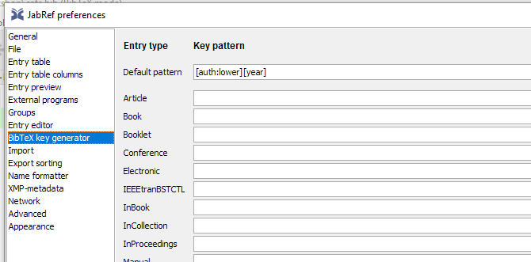
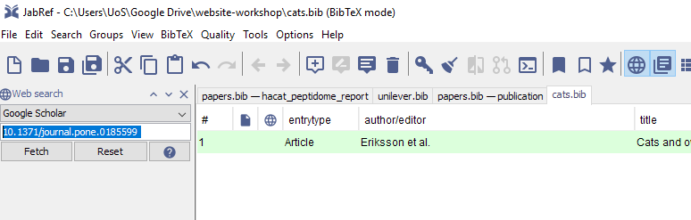
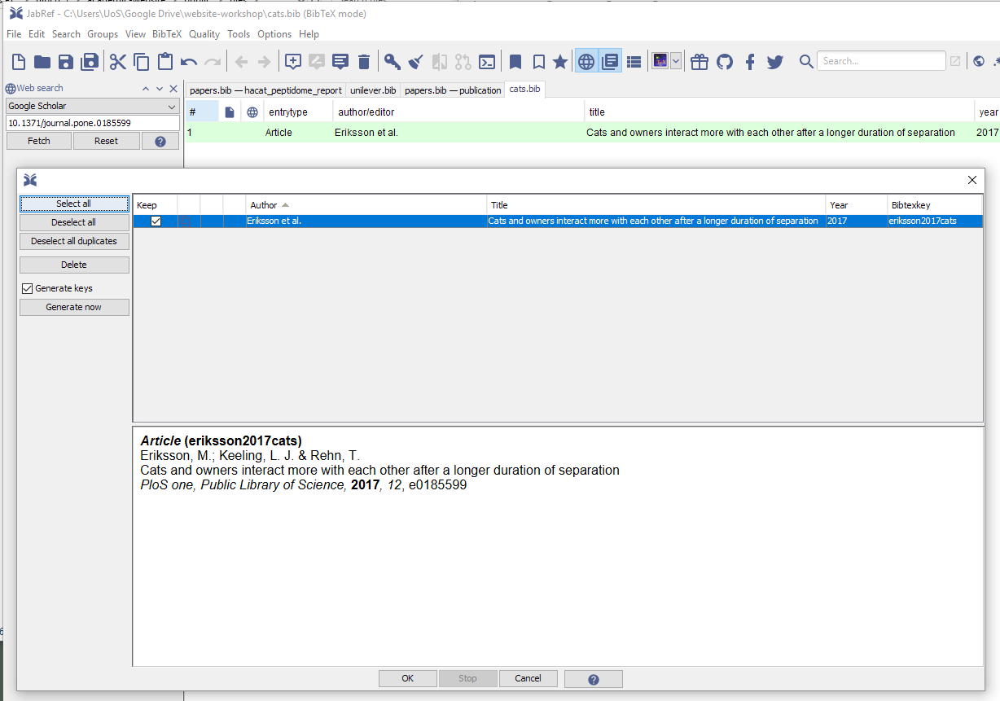

# Creating publication files

This is probably the most fiddly part. In the `content/publication` folder
we need `.md` files for each publication we want to add to our site.

Bibi being quite a lazy cat only has one publication, but we'll look at how
to automate the process for many.

## Citation format

To add publication citations, we first need them in `bibtex` format. This can be 
done using [JabRef](http://www.jabref.org/).

1. Open JabRef and go to `Options > Preferences > General` and ensure 
`Default encoding` is set to `UTF-8`

```{r jab-settings, eval=TRUE,out.width = '120%', echo=FALSE}
knitr::include_graphics("img/jabref_general_settings.PNG")
```

2. Then go to `Options > Preferences > Bibtex key generator` and
set this to `[auth:lower][year]` and then `OK`.


```{r jab-key, eval=TRUE,out.width = '120%', echo=FALSE}

```

3. Then create a library `File > New Bibtex Library`.

4. If you have exported your publications from EndNote or other software as bibtex
you can import this into your new library and then highlight the list and click
on the key icon to generate bibtex keys.

5. Alternatively, we can generate the list using the search function, here
I entered a DOI and searched with Google Scholar:

```{r jab-search, eval=TRUE,out.width = '120%', echo=FALSE}

```

Then I selected the publication and generated the key.

```{r jab-search-2, eval=TRUE,,out.width = '120%', echo=FALSE}

```

6. Now we save the bibtex library. Here it is `cats.bib`. It's just another
text file so can be viewed in any text editor.

## Converting Bibtex files

Converting to markdown requires some effort, fortunately 
[Lorenzo Buesetto](https://lbusett.netlify.com/post/automatically-importing-publications-from-bibtex-to-a-hugo-academic-blog/) wrote a function that required
a small hack to work with JabRef.

I found the function still may output files that need a bit of cleaning up, but
generally it works really well.

We need the `tidyverse, RefManageR, anytime` packages installed.

```{r bibtex-conversion, eval=FALSE}
bibtex_2academic <- function(bibfile,
                             outfold,
                             abstract = FALSE,
                             overwrite = FALSE) {
                             require(RefManageR)
                             require(dplyr)
                             require(stringr)
                             require(anytime)
                             
                             # Import the bibtex file and convert to data.frame
                             mypubs   <-
                             ReadBib(bibfile, check = "warn", 
                                     .Encoding = "UTF-8") %>%
                             as.data.frame()
                             
                             # assign "categories" to the different types of
                             # publications
                             mypubs   <- mypubs %>%
                             dplyr::mutate(
                             pubtype = dplyr::case_when(
                             bibtype == "Article" ~ "2",
                             bibtype == "Article in Press" ~ "2",
                             bibtype == "InProceedings" ~ "1",
                             bibtype == "Proceedings" ~ "1",
                             bibtype == "Conference" ~ "1",
                             bibtype == "Conference Paper" ~ "1",
                             bibtype == "MastersThesis" ~ "3",
                             bibtype == "PhdThesis" ~ "3",
                             bibtype == "Manual" ~ "4",
                             bibtype == "TechReport" ~ "4",
                             bibtype == "Book" ~ "5",
                             bibtype == "InCollection" ~ "6",
                             bibtype == "InBook" ~ "6",
                             bibtype == "Misc" ~ "0",
                             TRUE ~ "0"
                             )
                             )
                             
                             # create a function which populates the md template 
                             # based on the info
                             # about a publication
                             create_md <- function(x) {
                             # define a date and create filename by appending date 
                             # and start of title
                             if (!is.na(x[["year"]])) {
                             x[["date"]] <- paste0(x[["year"]], "-01-01")
                             } else {
                             x[["date"]] <- "2999-01-01"
                             }
                             
                             filename <- paste(
                             x[["date"]],
                             x[["title"]] %>%
                             str_replace_all(fixed(" "), "_") %>%
                             str_remove_all(fixed(":")) %>%
                             str_sub(1, 20) %>%
                             paste0(".md"),
                             sep = "_"
                             )
                             # start writing
                             if (!file.exists(file.path(outfold, filename)) |
                             overwrite) {
                             fileConn <- file.path(outfold, filename)
                             write("+++", fileConn)
                             
                             # Title and date
                             write(paste0("title = \"", x[["title"]], "\""),
                             fileConn,
                             append = T)
                             write(paste0("date = \"", anydate(x[["date"]]), "\""),
                             fileConn,
                             append = T)
                             
                             # Authors. Comma separated list, e.g. `["Bob Smith", 
                             # "David Jones"]`.
                             auth_hugo <-
                             str_replace_all(x["author"], " and ", "\", \"")
                             auth_hugo <-
                             stringi::stri_trans_general(auth_hugo, "latin-ascii")
                             write(paste0("authors = [\"", auth_hugo, "\"]"),
                             fileConn,
                             append = T)
                             
                             # Publication type. Legend:
                             # 0 = Uncategorized, 1 = Conference paper, 
                             # 2 = Journal article
                             # 3 = Manuscript, 4 = Report, 5 = Book,  6 = Book
                             # section
                             write(paste0("publication_types = [\"", x[["pubtype"]],
                                          "\"]"),
                             fileConn,
                             append = T)
                             
                             # Publication details: journal, volume, issue, 
                             # page numbers and doi link
                             publication <- x[["journal"]]
                             if (!is.na(x[["volume"]]))
                             publication <- paste0(publication,
                             ", (", x[["volume"]], ")")
                             if (!is.na(x[["pages"]]))
                             publication <- paste0(publication,
                             ", _pp. ", x[["pages"]], "_")
                             if (!is.na(x[["doi"]]))
                             publication <- paste0(publication,
                             ", ",
                             paste0("https://doi.org/",
                             x[["doi"]]))
                             
                             write(paste0("publication = \"", publication, "\""),
                             fileConn,
                             append = T)
                             write(paste0("publication_short = \"",
                             publication,
                             "\""),
                             fileConn,
                             append = T)
                             
                             # Abstract and optional shortened version.
                             if (abstract) {
                             write(paste0("abstract = \"", x[["abstract"]], "\""),
                             fileConn,
                             append = T)
                             } else {
                             write("abstract = \"\"",
                             fileConn,
                             append = T)
                             }
                             write(paste0("abstract_short = \"", "\""),
                             fileConn,
                             append = T)
                             
                             # other possible fields are kept empty. They can be
                             # customized later by
                             # editing the created md
                             
                             write("image_preview = \"\"",
                             fileConn,
                             append = T)
                             write("selected = false", fileConn, append = T)
                             write("projects = []", fileConn, append = T)
                             write("tags = []", fileConn, append = T)
                             #links
                             write("url_pdf = \"\"", fileConn, append = T)
                             write("url_preprint = \"\"",
                             fileConn,
                             append = T)
                             write("url_code = \"\"", fileConn, append = T)
                             write("url_dataset = \"\"",
                             fileConn,
                             append = T)
                             write("url_project = \"\"",
                             fileConn,
                             append = T)
                             write("url_slides = \"\"", fileConn, append = T)
                             write("url_video = \"\"", fileConn, append = T)
                             write("url_poster = \"\"", fileConn, append = T)
                             write("url_source = \"\"", fileConn, append = T)
                             #other stuff
                             write("math = true", fileConn, append = T)
                             write("highlight = true", fileConn, append = T)
                             # Featured image
                             write("[header]", fileConn, append = T)
                             write("image = \"\"", fileConn, append = T)
                             write("caption = \"\"", fileConn, append = T)
                             
                             write("+++", fileConn, append = T)
                             }
                             }
                             # apply the "create_md" function over the 
                             # publications list to generate
                             # the different "md" files.
                             
                             apply(
                             mypubs,
                             FUN = function(x)
                             create_md(x),
                             MARGIN = 1
                             )
                             }
```

To use this function, save it as `bibtex_2academic.R` and then
load the fcuntion into your R environment using `source("bibtex_2academic.R")`.

Then assuming you have a JabRef outputted Bixbtex file, here `cats.bib`
we need to assign variables for the bibtex file and the output location,
which in this case will be `content/publication`. Then we use these 
variables as arguement to the conversion function:

```{r use-converter}
# Bibtex file in my directory
my_bibfile <- "cats.bib"
# Where I want the markdown output to go
outfold <- "content/publication"
# Use the conversion function
bibtex_2academic <- function(my_bibfile,
                             outfold,
                             abstract = FALSE,
                             overwrite = FALSE
                             )
```

All being well, we should now have a markdown file for each publication (we 
only had one in this example) in the `content/publication`. It may need
some manual tweaking if the format on the webpage isn't quite right.

We can remove the example files that came with the template.

Bibi should now have her website configured and what's left is to re-deploy the
completed version which should look like this:

```{r final-site, out.width = '120%',echo=FALSE, eval=TRUE}

```


